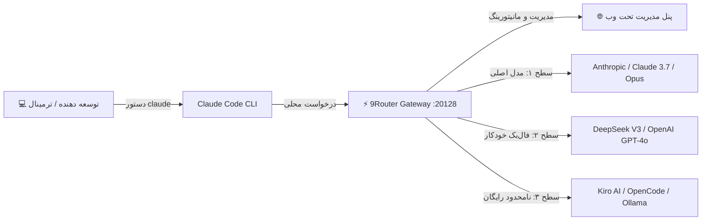

<div align="center">

# 🚀 9Router + Claude Code Integration
### پکیج نصب ۱-کلیکه و اتصال خودکار Claude Code به درگاه هوش مصنوعی 9Router
#### با فونت اختصاصی و بهینه‌سازی شده وزیرمتن (Vazirmatn) و رابط کاربری فارسی

[](LICENSE)
[](https://github.com)
[](https://docs.anthropic.com)
[](https://github.com/decolua/9router)

<br/>

[فارسی](#-راهنمای-فارسی) • [English](#-english-guide) • [ویژگی‌ها](#-ویژگی‌های-کلیدی) • [نصب سریع](#-نصب-سریع-فقط-با-یک-کلیک) • [کنترل از پنل مدیریت](#-کنترل-مدل‌ها-از-پنل-مدیریت)

---

</div>

<br/>

## 📖 راهنمای فارسی

این ریپازیتوری یک راه‌حل جامع، سریع و **۱-کلیکه** برای نصب، کانفیگ، اصلاح فونت‌ها و اتصال مستقیم **Claude Code** به درگاه **9Router** است. با این پکیج، توسعه‌دهندگان می‌توانند بدون مواجهه با خطاهای محدودیت سهمیه (Rate Limit) یا هزینه‌های سرسام‌آور توکن، کلاینت Claude را به ده‌ها ارائه‌دهنده هوش مصنوعی رایگان و تجاری متصل کنند.



---

## ✨ ویژگی‌های کلیدی

* **⚡ نصب ۱-کلیکه (1-Click Installer):** بدون نیاز به دستورات پیچیده یا تنظیمات دستی.
* **🎨 فونت زیبای وزیرمتن (Vazirmatn):** اصلاح کامل تایپوگرافی، اعداد و استایل‌های داشبورد وب 9Router برای پشتیبانی تمیز از زبان فارسی و انگلیسی.
* **🔄 فال‌بک خودکار ۳ سطحی (Smart Fallback):** در صورت اتمام کوتای یک پرووایدر، درخواست بدون وقفه به مدل پشتیبان بعدی هدایت می‌شود.
* **💰 صرفه‌جویی ۲۰ تا ۴۰ درصدی توکن (RTK Token Saver):** فشرده‌سازی خودکار لاگ‌ها، Diffهای گیت و خروجی‌های طولانی ترمینال.
* **🛡 ضد قطعی VPN و پروکسی:** کانفیگ دقیق `NO_PROXY` برای جلوگیری از تداخل فیلترشکن‌ها با ترافیک لوکال هاست.
* **🖥 کنترل کامل از پنل مدیریت:** مدیریت آنی کلیدها، تغییر مدل‌ها، مشاهده لاگ‌ها و وضعیت مصرف.

---

## ⚡ نصب سریع (فقط با یک کلیک)

### 🍏 برای کاربران مک (macOS):
کافیست فایل **`Install-9Router.command`** را دانلود کرده و روی آن **دوبار کلیک (Double-Click)** کنید!

یا در ترمینال مک/لینوکس دستور زیر را کپی و اجرا نمایید:

```bash
curl -fsSL https://raw.githubusercontent.com/m4tinbeigi-official/9Router-Claude/main/install.sh | bash
```

*(یا اگر ریپو را کلون کرده‌اید: `bash install.sh`)*

### 🪟 برای کاربران ویندوز (Windows):
پاورشل (PowerShell) را باز کرده و دستور زیر را اجرا کنید:

```powershell
Set-ExecutionPolicy Bypass -Scope Process -Force; .\install.ps1
```

---

## 🎛 کنترل مدل‌ها از پنل مدیریت

داشبورد 9Router در آدرس **[http://localhost:20128](http://localhost:20128)** در دسترس است:

1. **مدیریت ارائه‌دهندگان (Providers):** در منوی **Providers** می‌توانید پرووایدرهای مختلف (مثل OpenCode، Kiro AI، OpenAI، Gemini، Groq و...) را با یک کلیک فعال یا غیرفعال کنید.
2. **ساخت کامبوهای ترکیبی (Combos):** در بخش **Combos** می‌توانید اولویت‌بندی مدل‌ها را مشخص کنید (مثلاً اولویت اول Claude 3.7، در صورت ارور DeepSeek V3، در صورت قطعی Kiro AI).
3. **مشاهده زنده لاگ‌ها (Console Logs):** تمام پرامپت‌ها، پاسخ‌ها و میزان توکن مصرفی را به‌صورت لحظه‌ای بررسی کنید.
4. **چت سریع (Basic Chat):** بدون نیاز به ترمینال، مستقیماً از داخل مرورگر با مدل‌های متصل گفتگو کنید.

---

## 🚀 نحوه اجرای روزمره

### ۱. اجرای 9Router
* در مک: دوبار کلیک روی **`Start-9Router.command`** یا تایپ `9router` در ترمینال.

### ۲. شروع کدنویسی با Claude Code
ترمینال دلخواه خود را باز کرده و بنویسید:

```bash
claude
```

حالا کلاد سیستم شما کاملاً متصل به درگاه 9Router بوده و تمام قابلیت‌های هوشمند فعال هستند.

---

<br/>

## 🌐 English Guide

### 🚀 Overview
**9Router-Claude** is a 1-click automated setup and integration toolkit that seamlessly bridges **Claude Code** to the **9Router** local AI gateway with Persian typography enhancements (Vazirmatn font) and intelligent multi-provider routing.

### 📦 Quick Start (1-Line Command)

```bash
curl -fsSL https://raw.githubusercontent.com/m4tinbeigi-official/9Router-Claude/main/install.sh | bash
```

### 📁 Repository Structure
```text
├── Install-9Router.command  # macOS Double-Click 1-Click Installer
├── Start-9Router.command    # macOS Double-Click 9Router Launcher
├── install.sh               # Cross-platform Unix shell installer
├── install.ps1              # Windows PowerShell installer
├── README.md                # Comprehensive documentation (FA / EN)
└── LICENSE                  # MIT License
```

---

## 📄 لایسنس
این پروژه تحت مجوز [MIT License](LICENSE) منتشر شده است.
